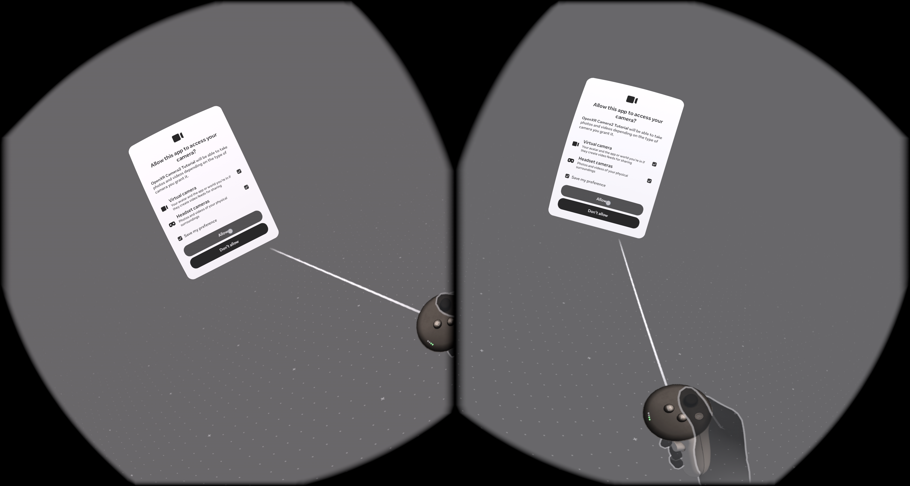

# OpenXR Camera2 Tutorial

Standalone tutorial that initializes OpenXR + Vulkan on Quest 3 and displays a full-screen Camera2 feed via CPU YUV conversion.

## Build

```bash
./gradlew.bat installDebug
```

## Status

- OpenXR instance/session lifecycle with Vulkan graphics binding.
- Runtime CAMERA permission via a minimal NativeActivity subclass.
- Camera2 capture with CPU YUV_420_888 to RGBA conversion, uploaded to swapchain images.

## Notes

- Requires user approval for headset camera access (`android.permission.CAMERA`).


