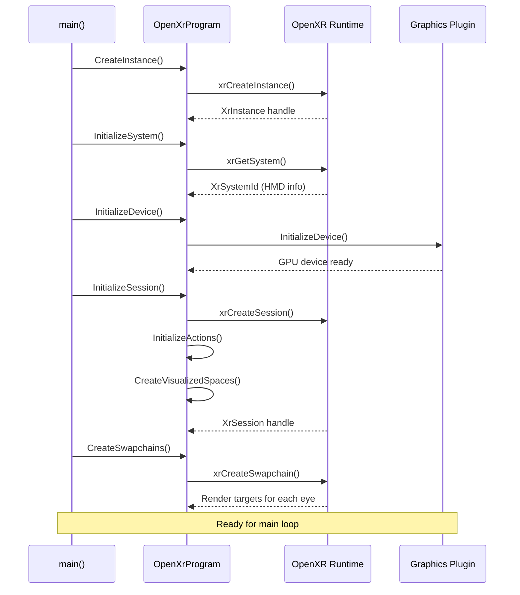
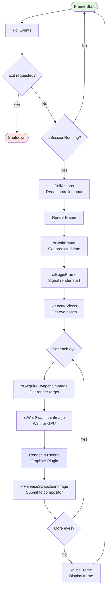
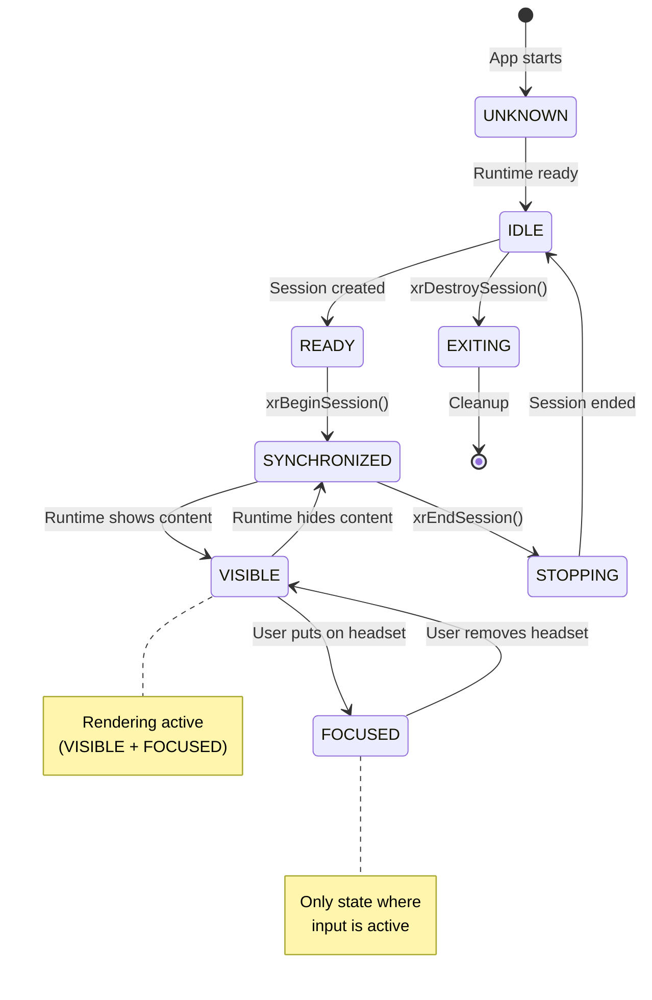

# Application Logic Overview: OpenXrProgram

> **Core application class for hello_xr sample**
> All platform and graphics-agnostic OpenXR logic lives here

---

## Architecture

```
┌─────────────────────────────────────────────────────────────┐
│                     OpenXrProgram                           │
│              (openxr_program.cpp)                           │
│                                                             │
│  • Pure OpenXR API calls                                    │
│  • Session lifecycle management                             │
│  • Main render loop                                         │
│  • Input/Action handling                                    │
│  • Frame synchronization                                    │
└─────────────────────────────────────────────────────────────┘
         │                         │                    │
         │                         │                    │
         ▼                         ▼                    ▼
┌──────────────────┐   ┌──────────────────┐   ┌──────────────────┐
│ Platform Plugins │   │ Graphics Plugins │   │   Helper Utils   │
│                  │   │                  │   │                  │
│ • Android        │   │ • Vulkan         │   │ • Geometry       │
│ • Win32          │   │ • OpenGL ES      │   │ • Math           │
│ • POSIX          │   │ • D3D11/D3D12    │   │ • Logging        │
│ • macOS          │   │ • Metal          │   │                  │
└──────────────────┘   └──────────────────┘   └──────────────────┘
```

**Key principle**: `OpenXrProgram` contains zero platform/graphics-specific code. All rendering and OS integration is delegated to plugins.

---

## Class: `struct OpenXrProgram : IOpenXrProgram`

### Core Methods (Lifecycle)

| Method | Purpose | Called By |
|--------|---------|-----------|
| **`CreateInstance()`** | Initialize OpenXR runtime connection | `main()` at startup |
| **`InitializeSystem()`** | Query system capabilities (HMD info) | `main()` after instance |
| **`InitializeDevice()`** | Initialize graphics device | `main()` before session |
| **`InitializeSession()`** | Create OpenXR session, setup spaces | `main()` before render loop |
| **`CreateSwapchains()`** | Create render targets for each eye | `main()` before rendering |

### Core Methods (Runtime)

| Method | Purpose | Called By |
|--------|---------|-----------|
| **`PollEvents()`** | Process OpenXR events (state changes) | Main loop every frame |
| **`PollActions()`** | Read controller input, update hand poses | Main loop every frame |
| **`RenderFrame()`** | Render stereo view, submit to compositor | Main loop every frame |
| **`IsSessionRunning()`** | Check if session is active | Main loop condition |
| **`IsSessionFocused()`** | Check if app has focus | Input handling |

### Helper Methods

| Method | Purpose |
|--------|---------|
| **`InitializeActions()`** | Setup controller input actions |
| **`CreateVisualizedSpaces()`** | Setup visualization reference spaces |
| **`LogLayersAndExtensions()`** | Debug info about available APIs |
| **`HandleSessionStateChangedEvent()`** | React to runtime state changes |

---

## Application Flow

### Startup Sequence



### Main Loop (Per Frame)



### Session State Machine



---

## Key OpenXR API Calls

### Initialization Phase

```cpp
// Instance creation
xrCreateInstance(&createInfo, &m_instance);

// System query (get HMD info)
xrGetSystem(m_instance, &systemGetInfo, &m_systemId);

// Session creation
xrCreateSession(m_instance, &sessionCreateInfo, &m_session);

// Action setup (controllers)
xrCreateActionSet(m_instance, &actionSetInfo, &m_input.actionSet);
xrCreateAction(m_input.actionSet, &actionInfo, &m_input.poseAction);

// Reference spaces
xrCreateReferenceSpace(m_session, &referenceSpaceCreateInfo, &m_appSpace);

// Swapchains (render targets)
xrCreateSwapchain(m_session, &swapchainCreateInfo, &swapchain.handle);
```

### Runtime Phase (Per Frame)

```cpp
// 1. Poll events (state changes)
xrPollEvent(m_instance, &eventDataBuffer);

// 2. Wait for frame timing
xrWaitFrame(m_session, &frameWaitInfo, &frameState);

// 3. Begin frame
xrBeginFrame(m_session, &frameBeginInfo);

// 4. Locate views (get eye poses)
xrLocateViews(m_session, &viewLocateInfo, &viewState, &m_views);

// 5. Render each eye
xrAcquireSwapchainImage(swapchain.handle, &acquireInfo, &swapchainImageIndex);
xrWaitSwapchainImage(swapchain.handle, &waitInfo);
// ... render 3D scene ...
xrReleaseSwapchainImage(swapchain.handle, &releaseInfo);

// 6. Submit frame to compositor
xrEndFrame(m_session, &frameEndInfo);

// 7. Poll actions (controller input)
xrSyncActions(m_session, &syncInfo);
xrGetActionStatePose(m_session, &getInfo, &poseState);
xrLocateSpace(handSpace, m_appSpace, predictedDisplayTime, &spaceLocation);
```

---

## What to Modify for Your App

### Keep Unchanged (Framework)

✅ **Lifecycle methods** - CreateInstance, InitializeSystem, InitializeSession
✅ **Event handling** - PollEvents, HandleSessionStateChangedEvent
✅ **Frame synchronization** - xrWaitFrame, xrBeginFrame, xrEndFrame
✅ **Swapchain management** - CreateSwapchains, acquire/wait/release logic

### Customize (Your Logic)

🔧 **`RenderFrame()` / `RenderLayer()`** - Replace cube rendering with your 3D content
🔧 **`PollActions()`** - Add your custom input handling
🔧 **`InitializeActions()`** - Define your app-specific controller actions
🔧 **Member variables** - Add your game state, assets, entities

### Example Modifications

```cpp
// ADD: Your app state
struct OpenXrProgram : IOpenXrProgram {
    // ... existing members ...

    // YOUR CODE:
    std::vector<GameObject> m_gameObjects;
    Physics::World m_physicsWorld;
    Audio::Engine m_audioEngine;
};

// MODIFY: Render loop
void RenderFrame() override {
    // Keep: xrWaitFrame, xrBeginFrame (framework)

    // YOUR CODE: Update game logic
    m_physicsWorld.Simulate(deltaTime);
    UpdateGameObjects(deltaTime);

    // Keep: xrLocateViews (framework)

    // YOUR CODE: Render your scene
    for (const GameObject& obj : m_gameObjects) {
        obj.Render(viewMatrix, projectionMatrix);
    }

    // Keep: xrEndFrame (framework)
}

// MODIFY: Input handling
void PollActions() override {
    // Keep: xrSyncActions (framework)

    // YOUR CODE: Handle your game input
    if (gripButton.wasPressed) {
        GrabObject();
    }
    if (triggerButton.wasPressed) {
        ShootWeapon();
    }
}
```

---

## Member Variables (Key State)

```cpp
struct OpenXrProgram : IOpenXrProgram {
    // OpenXR handles
    XrInstance m_instance;              // Runtime connection
    XrSystemId m_systemId;              // HMD system ID
    XrSession m_session;                // XR session handle
    XrSpace m_appSpace;                 // Reference space (world origin)

    // Session state
    XrSessionState m_sessionState;      // Current state (IDLE/READY/FOCUSED/etc)
    bool m_sessionRunning;              // Is session active?

    // Rendering
    std::vector<Swapchain> m_swapchains;      // Render targets (one per eye)
    std::vector<XrView> m_views;              // Eye poses (position/rotation)
    std::vector<XrViewConfigurationView> m_configViews;  // Resolution/FOV

    // Input
    struct InputState {
        XrActionSet actionSet;          // Action set handle
        XrAction grabAction;            // Grab button
        XrAction poseAction;            // Hand/controller pose
        XrSpace handSpace[2];           // Left/right hand spaces
        XrPath handSubactionPath[2];    // Left/right paths
    } m_input;

    // Plugins (injected)
    std::shared_ptr<IGraphicsPlugin> m_graphicsPlugin;   // Vulkan/D3D/OpenGL
    std::shared_ptr<IPlatformPlugin> m_platformPlugin;   // Android/Win32/etc
    std::shared_ptr<Options> m_options;                  // CLI options
};
```

---

## Typical Customization Workflow

1. **Start with hello_xr** - Build and run the sample
2. **Modify rendering** - Replace cube rendering in `RenderLayer()`
3. **Add game logic** - Implement update loop in `RenderFrame()`
4. **Customize input** - Extend `PollActions()` with your controls
5. **Add app state** - Introduce your game objects, physics, audio
6. **Keep framework intact** - Don't modify lifecycle/event handling

---

## Performance Considerations

### Critical Path (Every Frame)

```
PollEvents()      →  ~0.1ms   (event queue processing)
PollActions()     →  ~0.2ms   (input sync)
xrWaitFrame()     →  Variable (frame pacing, vsync)
RenderFrame()     →  <11ms    (90 FPS target)
  └─ Render eyes  →  <5ms ea  (parallelizable)
xrEndFrame()      →  ~0.5ms   (compositor submit)
```

**Budget**: 11.1ms total (90 FPS) or 8.3ms (120 FPS on Quest 3)

### Optimization Tips

- Keep `RenderLayer()` under 5ms per eye
- Use instanced rendering for multiple objects
- Minimize state changes in render loop
- Offload physics/audio to separate threads
- Use graphics plugin efficiently (batch draw calls)

---

## Debugging Tips

### Add Logging

```cpp
// In any method
Log::Write(Log::Level::Info, Fmt("My debug message: %d", value));

// View with adb logcat
adb logcat | findstr "hello_xr"
```

### Breakpoints (Windows/Visual Studio)

- Set breakpoints in `CreateInstance()`, `InitializeSession()`
- **Avoid breakpoints in render loop** (breaks VR experience)
- Use conditional breakpoints for specific frames

### State Inspection

```cpp
// Check session state
Log::Write(Log::Level::Info, Fmt("Session state: %s", to_string(m_sessionState)));

// Check view poses
for (const XrView& view : m_views) {
    Log::Write(Log::Level::Info, Fmt("Eye position: (%.2f, %.2f, %.2f)",
        view.pose.position.x, view.pose.position.y, view.pose.position.z));
}
```

---

## Related Files

- **`openxr_program.h`** - Interface definition (`IOpenXrProgram`)
- **`main.cpp`** - Entry point, calls lifecycle methods
- **`graphicsplugin_*.cpp`** - Rendering implementations
- **`platformplugin_*.cpp`** - OS integration
- **`geometry.h`** - Helper functions for cube generation
- **`options.h`** - Command-line argument parsing

---

## Quick Reference: Method Call Order

```
main()
  └─ CreateInstance()
      └─ LogLayersAndExtensions()
      └─ CreateInstanceInternal()
      └─ LogInstanceInfo()
  └─ InitializeSystem()
      └─ LogViewConfigurations()
      └─ LogEnvironmentBlendMode()
  └─ InitializeDevice()
  └─ InitializeSession()
      └─ InitializeActions()
      └─ CreateVisualizedSpaces()
  └─ CreateSwapchains()
  └─ while (IsSessionRunning())
      ├─ PollEvents()
      │   └─ HandleSessionStateChangedEvent()
      ├─ PollActions()  (if focused)
      └─ RenderFrame()
          └─ RenderLayer()
              ├─ xrWaitFrame()
              ├─ xrBeginFrame()
              ├─ xrLocateViews()
              ├─ For each eye:
              │   ├─ xrAcquireSwapchainImage()
              │   ├─ xrWaitSwapchainImage()
              │   ├─ Render 3D scene
              │   └─ xrReleaseSwapchainImage()
              └─ xrEndFrame()
  └─ Destructor cleanup
```

---

**Document Version**: 1.0
**Last Updated**: 2025-12-03
**Related**: [Developers_Guidelines.md](Developers_Guidelines.md), [Developers_Guidelines_Windows.md](Developers_Guidelines_Windows.md)
